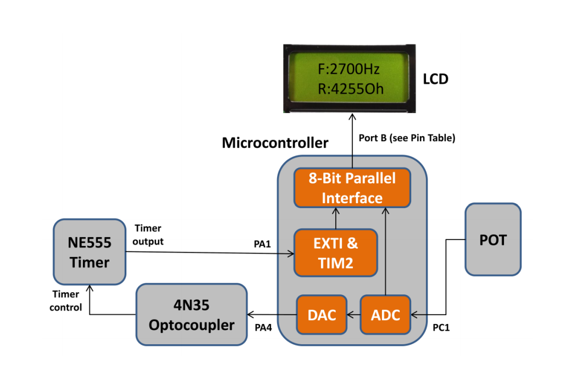

# PWM Signal Generation and Monitoring System

The goal of this laboratory project was to develop an embedded system for monitoring and controlling a pulse-width-modulated (PWM) signal generated by an external 555 timer (**NE555 IC**). The microcontroller (**STM32F051R8T6**) on the **STM32F0 Discovery** board measures the voltage across a potentiometer (POT) on the ECE 355 Emulation board and relays it to the external optocoupler (**4N35 IC**). The optocoupler is responsible for controlling the PWM signal frequency. The microcontroller measures the corresponding frequency for the PWM signal and displays both the frequency and POT resistance on the LCD located on the ECE 355 Emulation board.

Below is a diagram of the system.

